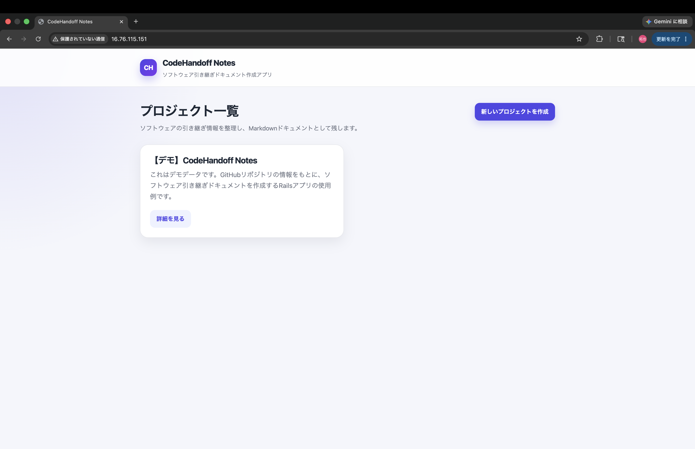
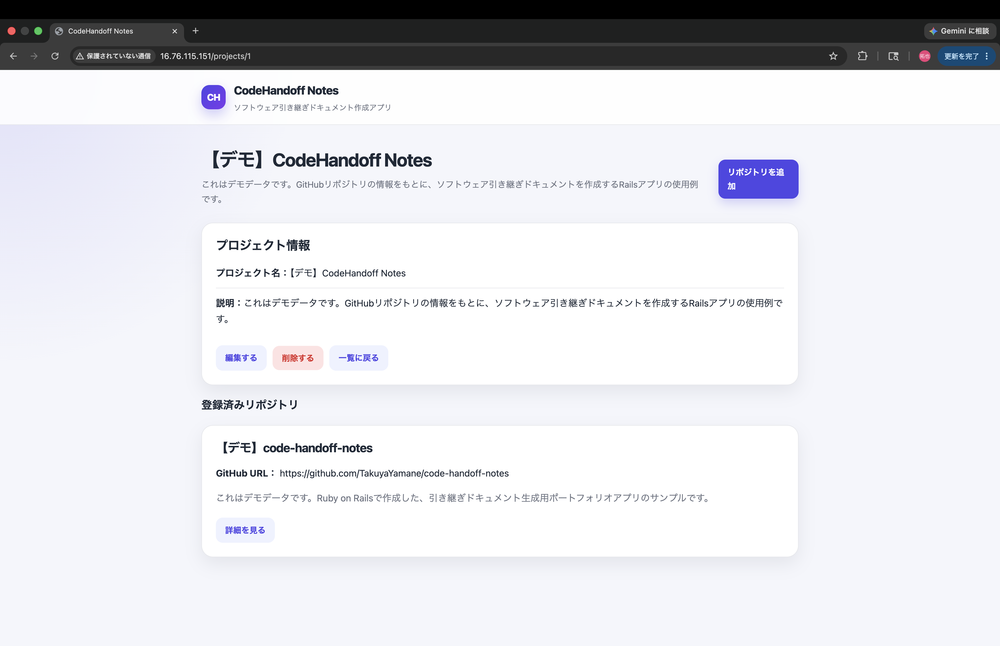
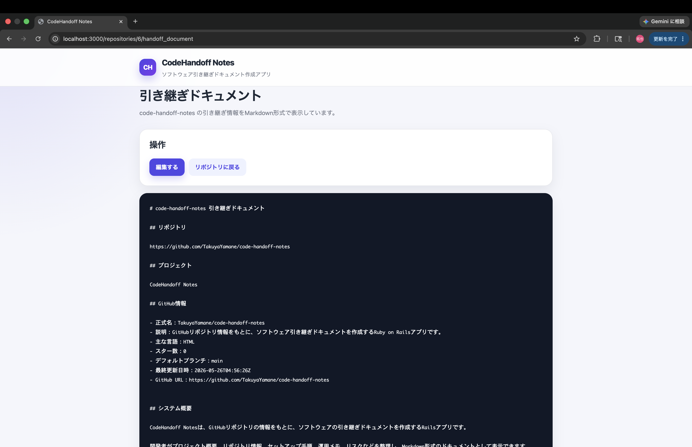

# CodeHandoff Notes

CodeHandoff Notes は、GitHubリポジトリの情報をもとに、ソフトウェアの引き継ぎドキュメントを作成する Ruby on Rails アプリです。

ソフトウェア開発における「属人化」「引き継ぎ不足」「ドキュメント不足」という課題に対して、プロジェクト情報・リポジトリ情報・セットアップ手順・運用メモ・リスクなどを整理し、Markdown形式のドキュメントとして残せるようにすることを目的としています。

## 作成した理由

私は、ソフトウェア開発におけるコード理解、保守、引き継ぎ、ドキュメント化の課題に強い関心があります。

開発現場では、重要な情報が個人の頭の中に残ったままになり、担当者が変わったときに仕様や運用方法が分からなくなることがあります。

このアプリでは、GitHubリポジトリを起点に情報を整理し、次の開発者が理解しやすい引き継ぎドキュメントを作成する流れを実装しました。

## 主な機能

- プロジェクトの作成・表示・編集・削除
- GitHubリポジトリの登録
- GitHub APIからリポジトリ情報を取得
- リポジトリ詳細画面でGitHub情報を表示
- 引き継ぎドキュメントの作成・編集
- GitHub情報を含めたMarkdownドキュメント生成
- 日本語UI
- デモデータの作成

## スクリーンショット

### プロジェクト一覧



### リポジトリ詳細



### 引き継ぎドキュメント



## 技術スタック

- Ruby
- Ruby on Rails
- PostgreSQL
- ERB
- CSS
- GitHub API
- HTTParty
- Git / GitHub

## データベース設計

```text
Project
  has_many :repositories

Repository
  belongs_to :project
  has_one :handoff_document

HandoffDocument
  belongs_to :repository
```

主なモデルは `Project`、`Repository`、`HandoffDocument` の3つです。

`Project` は複数の `Repository` を持ちます。  
`Repository` は1つの `Project` に所属します。  
`Repository` は1つの `HandoffDocument` を持ちます。  
`HandoffDocument` は1つの `Repository` に所属します。

この構成により、1つのソフトウェアプロジェクトに対して複数のリポジトリを登録し、それぞれに引き継ぎドキュメントを作成できます。

## アプリの流れ

このアプリでは、以下の流れで引き継ぎドキュメントを作成します。

```text
1. プロジェクトを作成する
2. GitHubリポジトリを登録する
3. GitHub APIからリポジトリ情報を取得する
4. システム概要・主な機能・DB設計・セットアップ手順などを入力する
5. Markdown形式の引き継ぎドキュメントを生成する
```

GitHubリポジトリを起点に、プロジェクト情報と運用メモを整理し、他の開発者が理解しやすい引き継ぎドキュメントとして残せるようにしています。

## GitHub API連携

登録されたGitHubリポジトリURLから、以下の情報を取得します。

- 正式なリポジトリ名
- GitHub上の説明
- 主な言語
- スター数
- デフォルトブランチ
- 最終更新日時
- GitHub URL

取得した情報は、リポジトリ詳細画面だけでなく、生成される引き継ぎドキュメントにも反映されます。

## セットアップ

```bash
git clone https://github.com/TakuyaYamane/code-handoff-notes.git
cd code-handoff-notes
bundle install
bin/rails db:create
bin/rails db:migrate
bin/rails db:seed
bin/rails server
```

ブラウザで以下を開きます。

```text
http://localhost:3000
```

## デモデータ

以下のコマンドで、デモ用のプロジェクト、リポジトリ、引き継ぎドキュメントが作成されます。

```bash
bin/rails db:seed
```

作成されるデモデータは、名前に `【デモ】` を付けています。

これにより、アプリを起動した直後でも、プロジェクト作成から引き継ぎドキュメント生成までの流れを確認できます。

## 工夫した点

### 1. ソフトウェア引き継ぎという実務に近い課題をテーマにしたこと

単なるCRUDアプリではなく、ソフトウェア開発における「引き継ぎ」「コード理解」「ドキュメント化」という課題をテーマにしました。

プロジェクト情報、リポジトリ情報、セットアップ手順、運用メモ、リスクを整理することで、他の開発者がプロジェクトを理解しやすくなることを目指しています。

### 2. GitHub APIを利用したこと

手入力だけでなく、実際のGitHubリポジトリ情報を取得し、リポジトリ詳細画面と引き継ぎドキュメントに反映できるようにしました。

これにより、GitHubリポジトリを起点にしたドキュメント作成の流れを実装しています。

### 3. デモデータを用意したこと

`bin/rails db:seed` を実行すると、すぐにアプリの使用例を確認できるようにしています。

初めてアプリを見る人でも、どのような情報を登録し、どのようなドキュメントが生成されるのかを理解しやすくしました。

### 4. 日本語UIにしたこと

採用担当者や開発者が、画面を見ただけで使い方を理解しやすいように、日本語UIにしています。

ボタンやフォーム、説明文も日本語にし、アプリの目的が伝わりやすくなるようにしました。

### 5. Markdown形式でドキュメントを生成したこと

引き継ぎドキュメントはMarkdown形式で生成されます。

Markdownにすることで、GitHubのREADME、社内Wiki、Issue、Pull Requestなどにも転用しやすい形式にしています。

## 今後の改善

- AWSへのデプロイ
- 認証機能
- チーム共有機能
- Markdownエクスポート機能
- GitHubリポジトリ内のREADMEやファイル構成の取得
- AIによる引き継ぎドキュメント生成
- テスト追加
- エラーハンドリング強化
- 本番環境でのログ管理
- UIのさらなる改善

## このアプリで学んだこと

- RailsのMVC構成
- Active Recordの関連
- CRUD実装
- ネストしたルーティング
- フォーム実装
- バリデーション
- 外部API連携
- Service Objectの作成
- Markdown生成
- Git / GitHubでの開発管理
- READMEによるポートフォリオの見せ方

## 今後の展望

今後は、GitHubリポジトリ内のREADMEやファイル構成も取得し、より具体的な引き継ぎドキュメントを生成できるようにしたいと考えています。

また、AIを活用して、コードやREADMEからシステム概要や注意点を自動生成する機能にも発展させたいです。

最終的には、開発者がプロジェクトを引き継ぐ際に、短時間で全体像を理解できるような支援ツールにしていきたいです。